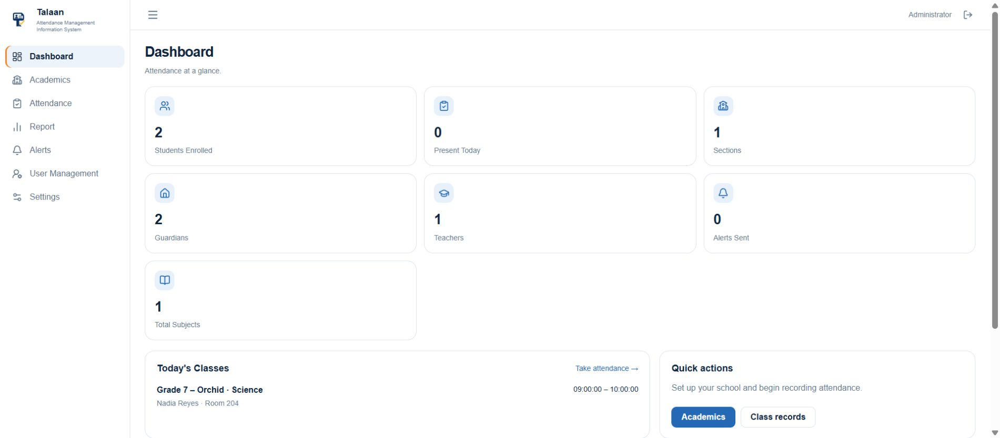
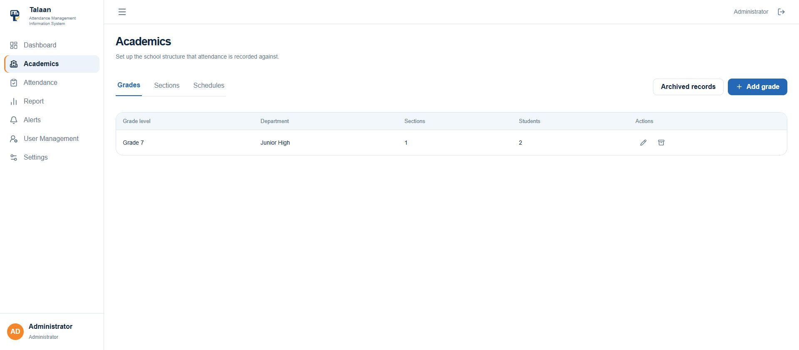
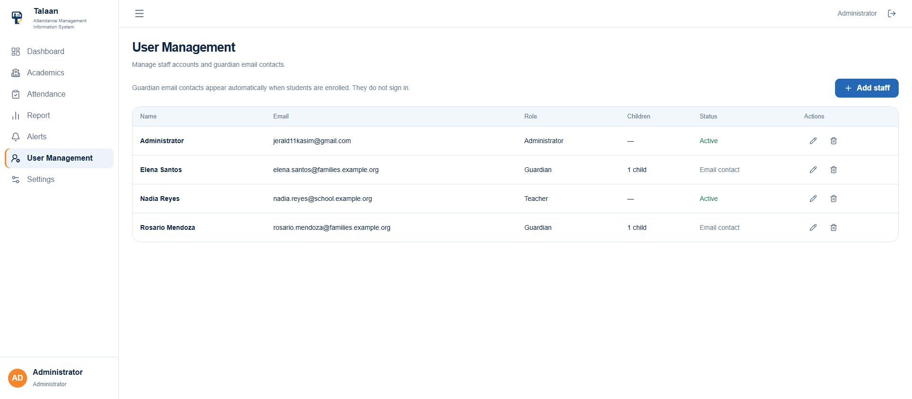
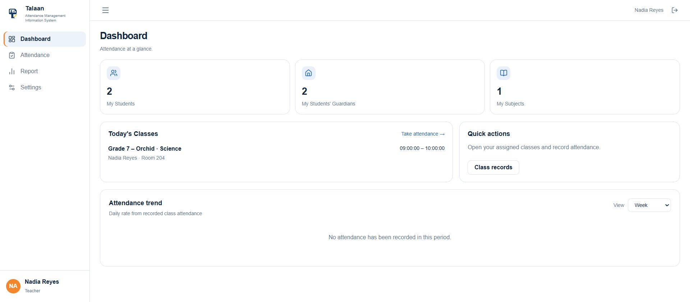
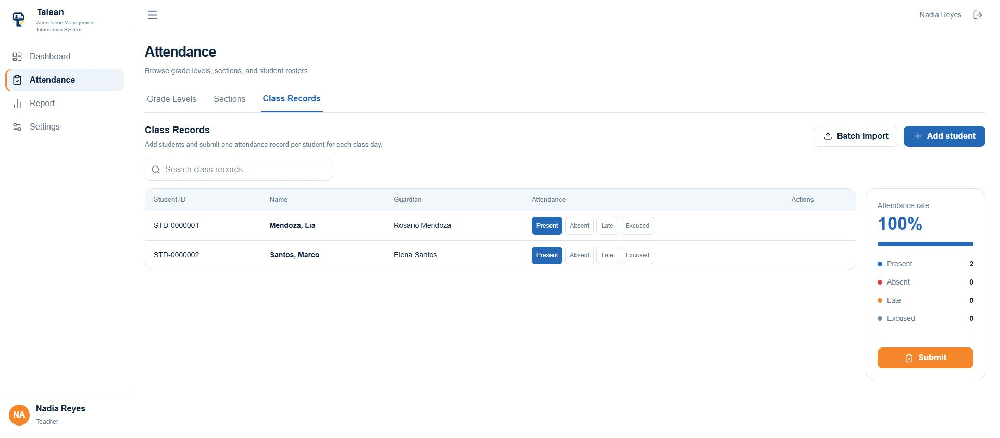
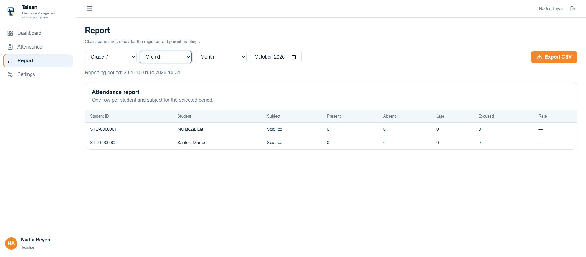
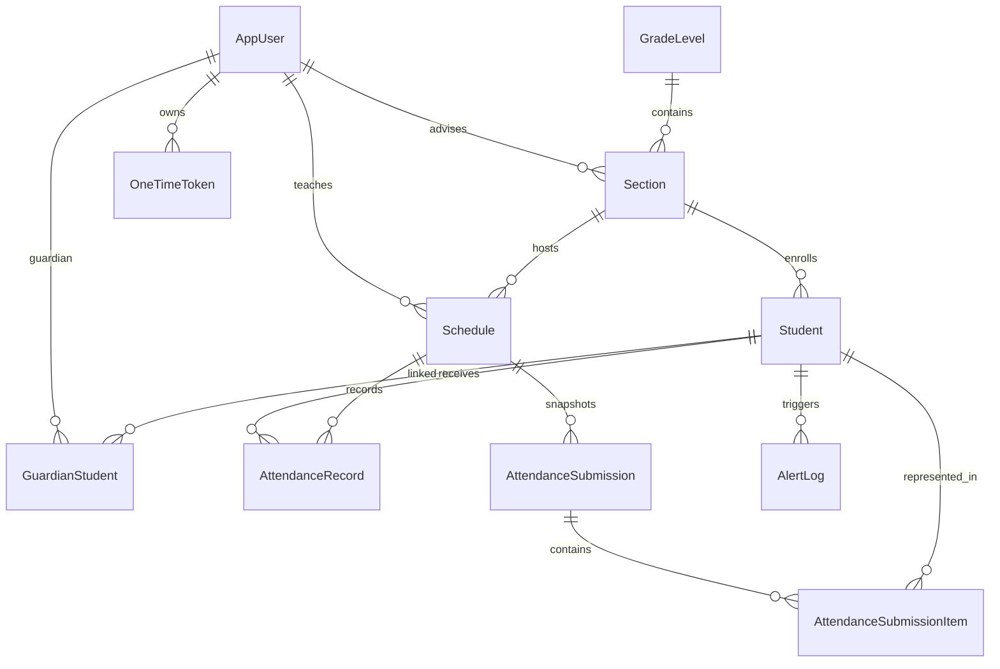
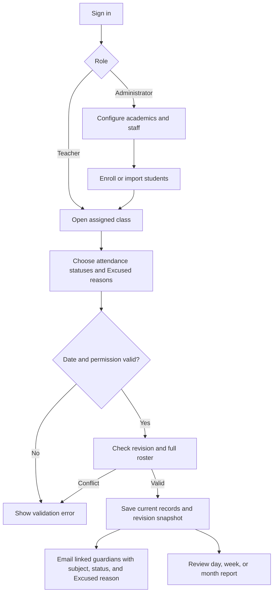
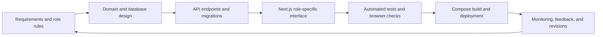

# Talaan — Attendance Management Information System

This guide is readable on GitHub and has a [GitHub repository copy](https://github.com/LowProgram1/Talaan-Attendance-Management-System/blob/main/DOCUMENTATIONS.md). The page links below let readers jump between sections; screenshots in the user guide are collapsible to keep the page short. Screenshots show fictional demonstration records captured before the local database was cleared.

## Contents

| Start here | Product guide | Technical reference |
| --- | --- | --- |
| [Run and configuration](#run-and-configuration) | [Administrator guide](#administrator-guide) | [Access control](#role-based-access-control-and-least-privilege) |
| [Technology and specifications](#technology-and-specifications) | [Teacher guide](#teacher-guide) | [Database structure](#database-structure) |
| [Modules and functions](#modules-features-and-functions) | [Screenshot evidence](#screenshot-evidence-by-feature) | [Diagrams and workflow](#entity-relationship-diagram) |
| [Cloudflare testing link](#cloudflare-quick-tunnel-for-group-testing) | [Use cases](#use-cases) | [Folder structure](#production-folder-structure) and [verification](#verification-record) |

## Run and configuration

From the repository root, copy `.env.example` to the ignored `.env`, set `POSTGRES_PASSWORD`, `ADMIN_EMAIL`, and `ADMIN_PASSWORD`, then run `docker compose up -d --build`. Open <http://localhost:3000>; health is available through the same origin at <http://localhost:3000/api/health>. The administrator account is seeded from `ADMIN_EMAIL` and `ADMIN_PASSWORD` on first startup. Changing those values later does not change an existing account's password. Email settings (`EMAIL_HOST`, `EMAIL_PORT`, `EMAIL_USE_SSL`, `EMAIL_USERNAME`, `EMAIL_PASSWORD`, `EMAIL_FROM`) drive staff invitations, password codes, and guardian attendance notices. Never commit `.env` or real credentials.

The browser calls `/api` on the same origin as the web app. Next.js forwards those requests to the ASP.NET Core API inside Docker; direct API access on `localhost:5080` remains available for local development. `PUBLIC_FRONTEND_URL` in `.env` permits the current HTTPS testing origin for API writes and supplies the base URL in new staff activation emails. When it is empty, activation emails use the local `FRONTEND_URL`. It must match the temporary tunnel URL exactly and should be changed or cleared when that URL changes.

### Cloudflare Quick Tunnel for group testing

The Cloudflare account used for testing has no domain configured. A Quick Tunnel supplies a temporary `trycloudflare.com` URL without changing DNS or installing a Windows service. Start it with `docker compose --profile tunnel up -d tunnel`, then find the current URL with `docker compose --profile tunnel logs tunnel | Select-String trycloudflare.com`. Put that URL in the ignored `.env` as `PUBLIC_FRONTEND_URL=https://...trycloudflare.com` and run `docker compose up -d --no-deps --force-recreate backend`. Verify `<tunnel-url>/api/health` and sign-in through the public site. Stop sharing with `docker compose --profile tunnel stop tunnel`.

The Quick Tunnel URL changes if its container is recreated, and the computer and Compose services must stay running. Anyone with the URL can open the login page; staff accounts still require authentication. The tunnel publishes the web app and its `/api` path, not files outside this project. For a stable hostname or restricted email access, configure a named tunnel or the Quick Tunnel `--allowed-mail` option using the [Cloudflare Quick Tunnel guide](https://developers.cloudflare.com/tunnel/get-started/quick-tunnels/).

## Technology and specifications

| Layer | Version or specification | Purpose |
| --- | --- | --- |
| ASP.NET Core | .NET 10 (`net10.0`) | Hosts the JSON API, routing, authorization, and background startup migration/seed work. |
| ASP.NET Core Identity | 10.0.0 | Stores users, roles, password hashes, lockout rules, and cookie sessions. |
| Entity Framework Core | 10.0.0 design package | Maps domain entities and applies versioned schema migrations. |
| Npgsql EF provider | 10.0.0 | Connects EF Core to PostgreSQL. |
| PostgreSQL | 17 Alpine container | Persistent relational database in the `postgres_data` Docker volume. |
| Next.js | 16.3.8, App Router | Serves the web interface and route layouts. |
| Next.js rewrite | `/api/:path*` → ASP.NET Core | Keeps browser API calls on the web app's origin so local and tunnel sign-in use the same host. |
| React / React DOM | 19.2.8 | Renders interactive forms, tables, navigation, and state. |
| TypeScript | 5.x | Checks frontend types at build time. |
| Tailwind CSS | 4.x | Supplies styling alongside the application stylesheet. |
| Lucide React | 1.51.x | Provides interface icons. |
| Node.js | 24 Alpine container | Builds and serves the frontend. |
| Docker Compose | Compose specification | Runs frontend, API, PostgreSQL, and Mailpit together. |
| Cloudflare Tunnel | `cloudflare/cloudflared:latest`, optional Compose profile | Creates a temporary HTTPS testing address without inbound router or firewall changes; the image tag is floating. |
| Mailpit | `axllent/mailpit:latest` | Local SMTP inbox at port 8025 when configured as the mail host; image tag is floating, so no fixed version is claimed. |
| Email transport | SMTP, configurable port and TLS | Sends staff invitations and account codes, plus guardian notices for Present, Absent, Late, and Excused attendance. |
| Session/security | HttpOnly, SameSite=Lax cookie; configured origin check for writes | Keeps credentials out of frontend storage and restricts writes to the local or explicitly configured public origin. The temporary tunnel uses HTTPS; a production deployment should also set a Secure cookie at the public origin. |
| Password policy | 12+ characters, upper/lower case, digit, symbol; 5 failures/15 minute lockout | Reduces weak-password and repeated-login risk. |

## Modules, features, and functions

The feature column describes what the user sees; the function column describes the corresponding behavior. Browser evidence is stored in `docs/module-screenshots/`, outside the production folder structure below. The screenshot mapping after this table links each image to the feature it shows.

| Module / access | Feature | Function and explanation |
| --- | --- | --- |
| Login / staff | Email and password sign in | `POST /api/auth/login` accepts active, confirmed Administrator and Teacher accounts only and issues an Identity cookie; failed attempts count toward lockout. Guardian contacts cannot sign in. |
| Login / staff | Remember me and sign out | Session persistence follows the login choice; `POST /api/auth/logout` ends the cookie session. |
| Password recovery / staff | Forgot password | Sends a six-digit code for an eligible staff account without disclosing account existence. `POST /api/auth/reset` validates the code and new password. |
| Account activation / invited staff | Invitation link and initial password | The form provides show/hide controls for the new and confirmation passwords, displays whether they match, and prevents submission until the password meets policy and both entries match. `POST /api/auth/activate` accepts only invited staff. |
| Dashboard / administrator | School totals and trends | `GET /api/dashboard` returns school counts, including distinct active subjects, teachers, and alerts; `/api/dashboard/trend` aggregates attendance. |
| Dashboard / teacher | Assigned student, guardian, and subject counts | Shows active students in advised or assigned sections, distinct guardian contacts linked to active students in the teacher's active scheduled sections, and distinct active subjects assigned to that teacher. The API response omits administrator counts. Assigned classes and attendance trend remain available below the totals. |
| Academics / administrator | Grade levels | Create, edit, list, archive, and restore grade levels; department labels help organize the school structure. |
| Academics / administrator | Sections | Attach sections to grades, set room and adviser, then edit, archive, or restore them. Used records are retained for history. |
| Academics / administrator | Schedules | Assign a teacher, subject, and time to a section. Historical schedules cannot have their teacher, subject, section, or time rewritten after attendance exists. |
| Attendance / administrator, teacher | Grade → section → class records drill-down | Lists permitted grades, sections, schedules, and student rosters. Teacher queries are narrowed to assigned work. |
| Class records / administrator, teacher | Student enrollment and search | Add students and guardian details; the server generates `STD-0000001` style student numbers. Search and pagination help locate students. |
| Class records / administrator | Edit, archive, restore | Edit student and guardian details or soft-delete/restore a student while retaining past attendance history. |
| Class records / administrator, teacher | CSV import | Download the section-prefilled template, preview validated rows, then commit valid students; teacher imports are limited to assigned sections. |
| Attendance entry / administrator, assigned teacher | Present, Absent, Late, Excused | Select one status per roster member and submit a full class-day batch. Each Excused status requires a student-specific reason (up to 500 characters). Teachers can submit only for the current Manila school day. |
| Guardian email notifications / linked contacts | Subject and reason | The first saved status for a student/subject/date sends an email to linked guardian addresses. Later revisions send another email only when that student's status or Excused reason changes. Every notice names the subject; Excused notices include the reason. Delivery success or failure is logged. |
| Guardian email notifications / administrator audit | Delivery result | Each addressed guardian produces an `AlertLogs` entry. SMTP success marks it delivered; a send error is logged as failed while the saved attendance remains available for review. The current implementation has no automatic retry queue. |
| Attendance entry / administrator | Past-day correction | Select an earlier date and provide a required reason; every submission creates a numbered immutable snapshot while current records reflect the latest status. |
| Attendance entry / staff | Conflict and retry protection | Expected revision blocks stale overwrites; an idempotency key keeps repeated submission requests from creating duplicate revisions. |
| Reports / administrator, teacher | Single attendance table | Select grade, section, and Day, Week, or Month; one table shows each student's subject counts and attendance rate for the chosen date range. Week runs Monday to Sunday. CSV export uses the displayed period. Teachers receive only their assigned schedule data. |
| Table pagination / staff views | Previous and Next, 20 rows per page | Academics, Class Records, Attendance grade and section lists, User Management, and Reports paginate their tables. |
| Reports / administrator, teacher | CSV export | Download the selected day, week, or month across all report pages, including subject and Present/Absent/Late/Excused counts. |
| Alerts / administrator | Delivery log | View the most recent 100 guardian notification attempts and delivery results. A changed Present, Absent, Late, or Excused status sends the student, subject, date, and status; Excused also sends its reason. |
| User Management / administrator | Staff invitations | Add a Teacher or Administrator by name and email; activation is completed through an emailed link. |
| User Management / administrator | Staff and guardian contacts | Lists staff activation state and guardian child count. Guardian contacts are created or linked during enrollment for email delivery; they have no portal access or activation invitation. |
| User Management / administrator | Actions: edit and delete | Edit a user's name and email; staff roles can change between Teacher and Administrator. The signed-in administrator can edit their own name here but cannot change their own email or role, or delete their own account. Deletion removes an unlinked account and its pending tokens; linked guardian contacts, advisers, assigned teachers, and attendance actors are protected to preserve school history. |
| Settings / staff | Profile | Change display name; the login email is read-only. |
| Settings / staff | Password change | Request a six-digit code to the registered email and confirm it with a strong new password; codes expire after 10 minutes and allow five attempts. |

## Administrator guide

Use the left navigation to move between modules. The administrator can set up the school, invite staff, manage students, review all reports, and inspect notification delivery. The screenshots below show a temporary Grade 7 Orchid Science class with Nadia Reyes and two enrolled students; those records were removed after capture.

| Step | Where to go | What to do | Screenshot |
| --- | --- | --- | --- |
| 1 | **Dashboard** | Review enrolled students, sections, guardians, teachers, alerts, total subjects, and today's classes. Use **Take attendance** or **Quick actions** to continue. | [Dashboard](module-screenshots/admin-guide-dashboard.jpg) |
| 2 | **Academics** | Add a grade, section, and schedule. Choose the teacher, subject, and class time. Use the Grades, Sections, and Schedules tabs to edit or archive records. | [Academics](module-screenshots/admin-guide-academics.jpg) |
| 3 | **User Management** | Select **Add staff** to invite a Teacher or Administrator. Use the **Actions** column to edit a user or delete an unlinked account. Guardian email contacts appear after student enrollment and cannot sign in. | [User Management](module-screenshots/admin-guide-users.jpg) |
| 4 | **Attendance → Grade Levels → Sections → Class Records** | Add a student with guardian name and email, or preview a CSV import. Select statuses and submit the full roster for a date. Administrators may correct an earlier date with a correction reason. | [Class Records](module-screenshots/class-records-sofia.jpg) |
| 5 | **Report** and **Alerts** | Select a grade, section, and Day, Week, or Month period in the single report table; export CSV if needed. Open Alerts to review guardian email delivery results. | [Report](module-screenshots/report-monthly.jpg) · [Alerts](module-screenshots/guardian-alert.jpg) |
| 6 | **Settings** | Update your display name or request a password-change code. The login email is read-only in Settings. | [Settings](module-screenshots/settings-password.jpg) |

<details markdown="1"><summary>View administrator dashboard screenshot</summary>



</details>

<details markdown="1"><summary>View Academics screenshot</summary>



</details>

<details markdown="1"><summary>View User Management Actions screenshot</summary>



</details>

[Back to contents](#contents)

## Teacher guide

An administrator invites a teacher by email. Open the invitation, create and confirm a strong password, then sign in. A teacher sees only assigned work; the sidebar contains Dashboard, Attendance, Report, and Settings. Guardian contacts receive attendance email and do not have a portal account.

| Step | Where to go | What to do | Screenshot |
| --- | --- | --- | --- |
| 1 | **Dashboard** | Check **My Students**, **My Students’ Guardians**, **My Subjects**, assigned classes, and attendance trend. The example shows 2 students, 2 distinct guardian contacts, and 1 subject; administrator totals are absent. | [Teacher dashboard](module-screenshots/teacher-guide-dashboard.jpg) |
| 2 | **Attendance → Grade Levels → Sections → Class Records** | Open an assigned class, add or import students, search the roster, and choose Present, Absent, Late, or Excused for each student. Excused requires a reason of up to 500 characters. Review the summary and select **Submit** for today's class. The screenshot shows unsaved choices; it does not prove a submission. | [Teacher Class Records](module-screenshots/teacher-guide-class-records.jpg) |
| 3 | **Report** | Select an assigned grade and section, choose Day, Week, or Month, review the single student/subject table, and export CSV. The example was captured before attendance was submitted, so its counts are zero. | [Teacher report](module-screenshots/teacher-guide-report.jpg) |
| 4 | **Settings** | Edit your display name or request a six-digit password-change code by email. | [Settings](module-screenshots/settings-password.jpg) |

<details markdown="1"><summary>View teacher dashboard screenshot</summary>



</details>

<details markdown="1"><summary>View teacher Class Records screenshot</summary>



</details>

<details markdown="1"><summary>View teacher Report screenshot</summary>



</details>

[Back to contents](#contents)

### Screenshot evidence by feature

All images below were captured from the running local application on 2026-10-06, before a later data reset. They are historical feature evidence; the pictured school records are no longer in the live database. The cursor is outside every retained frame. Names and `.example.org` addresses are fictional demonstration data; earlier captures may include records that predate the latest implementation.

| Module / feature | Browser evidence | What the image verifies |
| --- | --- | --- |
| Login / sign-in form | [Login screen](module-screenshots/login.jpg) | Email, password, remember-me, and recovery controls render without showing credentials. |
| Password recovery / request form | [Recovery screen](module-screenshots/password-recovery.jpg) | The code request form and return-to-login link render. Code delivery/reset was not exercised. |
| Account activation / password setup | [Activation form](module-screenshots/account-activation.jpg) | The invitation landing form shows password policy hints, create and confirm fields, and visibility icons. No account was activated during capture. |
| Dashboard / administrator totals and classes | [Dashboard](module-screenshots/dashboard.jpg) | Administrator-only teacher and alert counts, distinct subject total, enrolled students, and today's assigned classes appear. |
| Dashboard / current administrator guide | [Populated admin dashboard](module-screenshots/admin-guide-dashboard.jpg) | Grade 7 Orchid Science appears with 2 students, 2 guardians, 1 teacher, and 1 subject before cleanup. |
| Academics / current administrator guide | [Grade setup](module-screenshots/admin-guide-academics.jpg) | Grade 7 has one section and two enrolled students. |
| User Management / current administrator guide | [Actions column](module-screenshots/admin-guide-users.jpg) | Administrator, Teacher, and guardian contact rows show Edit and Delete controls; self-delete is disabled. |
| Dashboard / teacher guide | [Teacher totals](module-screenshots/teacher-guide-dashboard.jpg) | Nadia sees only her 2 students, 2 distinct guardian contacts, and 1 Science subject. |
| Class records / teacher guide | [Teacher roster](module-screenshots/teacher-guide-class-records.jpg) | Nadia's assigned Science roster shows Lia and Marco and status choices before submission. |
| Report / teacher guide | [Teacher period report](module-screenshots/teacher-guide-report.jpg) | The single table is scoped to Grade 7 Orchid Science; counts are zero because no attendance was submitted for this capture. |
| Academics / grade list | [Grade records](module-screenshots/academics-grades.jpg) | Grade 7 lists one section and five students. |
| Academics / teacher schedule | [Science schedule](module-screenshots/academics-science-schedule.jpg) | Elena Navarro is assigned to Grade 7–A Science, 09:00–10:00. |
| User Management / teacher invitation | [Elena's account row](module-screenshots/teacher-account.jpg) | Teacher role and pending activation are visible. |
| User Management / guardian link | [Guardian contact directory](module-screenshots/guardian-account.jpg) | Rosario has two linked children and an Email contact status; the page states guardian contacts do not sign in. This historical image predates the Actions column. |
| Class records / enter student details | [Student form](module-screenshots/student-entry-form.jpg) | Sofia Isabel Villanueva and Rosario Villanueva are entered in the UI. This capture shows the form; the saved roster appears in the next image. |
| Class records / enrollment and status | [Saved roster and attendance](module-screenshots/class-records-sofia.jpg) | Sofia has a generated student number, Rosario appears as guardian, Miguel is Late, and the class rate is 80%. |
| Attendance entry / Excused reason validation | [Excused reason form](module-screenshots/excused-reason-form.jpg) | Sofia's Excused option reveals her reason field and disables Submit while it is blank. The selection was not submitted during capture. |
| Reports / period summary and export | [Report view](module-screenshots/report-monthly.jpg) | The single student/subject table shows attendance counts and rates for the selected month; the same selector offers Day and Week. CSV exports the displayed period. |
| Alerts / guardian delivery | [Rosario alert](module-screenshots/guardian-alert.jpg) | Historical Late delivery appears in the administrator log. The expanded four-status notification flow is verified in code and automated tests; this image predates that change. |
| Settings / password request | [Password settings](module-screenshots/settings-password.jpg) | The signed-in password-change entry point renders; no credential was changed. |

The early Elena and Rosario captures are historical; neither account exists in the cleared live database. The later Nadia teacher account and Science records were also removed after the guide screenshots. RBAC endpoint behavior is documented from API code and tests separately from browser evidence.

## Role-based access control and least privilege

| Role | Allowed scope | Restrictions enforced by the API |
| --- | --- | --- |
| Administrator | School setup, all staff views, student management, reports, alerts, user invitations and account maintenance, past-day corrections | Still requires authentication; cannot use an invalid or stale submission revision. User edit and delete endpoints require the Administrator policy and reject self-deletion or deletion of an account linked to school records. |
| Teacher | Assigned student, guardian, and subject dashboard counts; academic/section data, assigned roster, attendance, reports, settings | `Staff` policy plus assignment checks limit reads, imports, enrollment, attendance, and reports. The dashboard API returns only teacher-scoped totals. Cannot edit/archive students or change academics; attendance submissions are limited to today. |
| Guardian email contact | Receives attendance messages for linked children | No sign-in, activation, dashboard, My Children page, or guardian API routes. Existing guardian credentials are rejected at login; staff-only account endpoints reject old guardian sessions. |

Navigation hides unrelated modules, but the API is the security boundary. `Administrator` and `Staff` policies are declared in `Program.cs`; individual endpoints also check teacher assignments. A teacher account is invited by an administrator and assigned to a section or schedule. Guardian records remain linked to students so the system can address email notifications, but guardian role holders cannot authenticate or use account endpoints.

## Use cases

| Actor | Trigger | Outcome |
| --- | --- | --- |
| Administrator | Configure grade, section, teacher, schedule | A class is available for enrollment and attendance. |
| Administrator or assigned teacher | Enroll student or import roster | Student number and guardian email contact link are created; no guardian invitation is sent. |
| Assigned teacher | Submit today's class attendance | Current statuses and an immutable revision are saved; guardian emails include each changed student's subject and status. Excused requires a reason that appears in the email. |
| Administrator | Correct an earlier day with reason | A new revision preserves the correction trail. |
| Administrator | Edit or delete a user | Updates a staff account or guardian contact, or deletes an account without school links. The API prevents deletion that would break enrollment or attendance history. |
| Staff | Review day, week, or month and export report | One table shows counts and rates; CSV uses the selected period. |
| Guardian email contact | Receive a status update | Linked contacts receive Present, Absent, Late, or Excused notifications without signing in. |

## Database structure

PostgreSQL uses the `public` schema. EF Core migrations create the tables below at API startup. `uuid` is used for application and Identity IDs, `date` for school dates, and `timestamp with time zone` for recorded instants. The table names below are the physical database names.

| Table | Primary key | Main columns and types | Foreign keys / purpose |
| --- | --- | --- | --- |
| `AspNetUsers` | `Id` (`uuid`) | `Email`, `UserName`, `PasswordHash`, `EmailConfirmed`, `FullName`, `IsActive`, lockout fields | Identity accounts for administrators and teachers; guardian rows are retained as email contacts and cannot sign in. |
| `AspNetRoles` | `Id` (`uuid`) | `Name`, `NormalizedName` | Defines `Administrator`, `Teacher`, and the contact-only `Guardian` role. |
| `AspNetUserRoles` | (`UserId`, `RoleId`) | Both `uuid` | Joins users to roles; FKs to `AspNetUsers` and `AspNetRoles`. |
| `AspNetUserClaims` | `Id` | `UserId`, claim type/value | Identity claim storage; FK to `AspNetUsers`. |
| `AspNetRoleClaims` | `Id` | `RoleId`, claim type/value | Identity role-claim storage; FK to `AspNetRoles`. |
| `AspNetUserLogins` | (`LoginProvider`, `ProviderKey`) | `UserId`, provider display name | Identity external-login storage; FK to `AspNetUsers`. |
| `AspNetUserTokens` | (`UserId`, `LoginProvider`, `Name`) | `Value` | Identity user-token storage; FK to `AspNetUsers`. |
| `GradeLevels` | `Id` (`uuid`) | `Name`, `Department`, `IsArchived` | School grade/departments; `Name` has a unique index. |
| `Sections` | `Id` (`uuid`) | `Name`, `Room`, `GradeLevelId`, nullable `AdviserId`, `IsArchived` | FKs to `GradeLevels` and adviser `AspNetUsers`. |
| `Schedules` | `Id` (`uuid`) | `SectionId`, `TeacherId`, `Subject`, `StartsAt`, `EndsAt`, `IsArchived` | FKs to `Sections` and teacher `AspNetUsers`. |
| `Students` | `Id` (`uuid`) | unique `StudentNumber`, names, `DateOfBirth` (`date`), `SectionId`, `IsDeleted` | FK to `Sections`; deletion is a soft-delete flag. |
| `GuardianStudents` | (`GuardianId`, `StudentId`) | Both `uuid` | Many-to-many guardian/student contact link; FKs to `AspNetUsers` and `Students`. Used to address notifications. |
| `Attendance` | `Id` (`uuid`) | `StudentId`, `ScheduleId`, `Date` (`date`), `Status`, nullable `ExcuseReason`, `RecordedById`, `UpdatedAt` | FKs to `Students` and `Schedules`; current status and any Excused reason per student, class, and date. `RecordedById` identifies the actor but has no database FK. |
| `AttendanceSubmissions` | `Id` (`uuid`) | `ScheduleId`, `Date`, `SubmittedById`, `SubmittedAt`, `Revision`, `IdempotencyKey`, nullable `CorrectionReason`, four status counts | FKs to `Schedules` and `AspNetUsers`; one immutable submission header per revision. |
| `AttendanceSubmissionItem` | (`AttendanceSubmissionId`, `StudentId`) | copied student number/name, guardian names, `Status`, nullable `ExcuseReason` | FK to `AttendanceSubmissions`; the reason is preserved with each revision. `StudentId` is snapshot data without a database FK. |
| `OneTimeTokens` | `Id` (`uuid`) | `UserId`, `Purpose`, `Hash`, `ExpiresAt`, `Attempts`, `Used` | Hashed activation/reset/change-password codes. `UserId` is indexed but has no database FK. |
| `AlertLogs` | `Id` (`uuid`) | `StudentId`, `Recipient`, `Status`, `Delivered`, `CreatedAt` | Notification delivery history. `StudentId` is a stored reference without a database FK. |
| `__EFMigrationsHistory` | `MigrationId` | `ProductVersion` | EF Core record of applied migrations. |

| Database rule | Implementation and reason |
| --- | --- |
| One current status | Unique index on `Attendance(StudentId, ScheduleId, Date)` prevents duplicate current records. |
| Ordered correction history | Unique index on `AttendanceSubmissions(ScheduleId, Date, Revision)` preserves one row per revision number. |
| Safe retry | Unique `AttendanceSubmissions.IdempotencyKey` prevents a retried request from adding another revision. |
| Stable student identity | Unique `Students.StudentNumber`; PostgreSQL sequence `student_number_sequence` supplies the numeric portion of `STD-0000001`. |
| Guardian notification scope | `GuardianStudents` selects the linked email recipients for each changed student's attendance. |
| Excused reason | The API rejects an Excused status without a student-specific reason; the current row and revision snapshot preserve it. |
| Data retention | `IsArchived` on academics and `IsDeleted` on students keep historical references available. |

The `AttendanceExcuseReason` migration adds the two nullable reason columns. Existing records remain valid, while new Excused submissions require a reason. The database also has indexes on common relationship and lookup columns, including section/teacher assignments and token user/purpose. A schema backup must include both the tables and `student_number_sequence`.

### Attendance notification data path

| Step | Stored or transmitted data | Behavior |
| --- | --- | --- |
| Save attendance | `Attendance` and `AttendanceSubmissionItem` | Saves the current status and an immutable revision item. An Excused item also stores its required reason. |
| Resolve recipients | `GuardianStudents` → guardian `AspNetUsers.Email` | Addresses only contacts linked to the student whose status or Excused reason changed. |
| Send message | SMTP | The email identifies the student, class subject, school date, and Present/Absent/Late/Excused status. Excused messages include the reason. |
| Record result | `AlertLogs` | Stores the recipient, status, time, and success or failure for the administrator's Alerts view. Attendance is retained if SMTP delivery fails. |

## Entity relationship diagram



Identity role and user-role tables support `AppUser` authorization. `AttendanceRecord` has a unique student/schedule/date combination; submissions are separately revisioned by schedule/date and contain immutable item snapshots.

## Attendance flowchart



## System development workflow



## Production folder structure

```text
AMIS/
├── .env.example                 # Configuration template; real .env is ignored
├── docker-compose.yml           # Application services, persistent volumes, optional tunnel
├── frontend/
│   ├── public/talaan-mark.svg   # Brand asset
│   ├── src/app/                 # Login, activation, recovery, workspace, user management, icon
│   ├── src/lib/                 # API and password helpers
│   ├── next.config.ts           # Same-origin API rewrite
│   ├── package.json
│   └── Dockerfile
└── backend/AMIS.API/
    ├── Auth.cs, Academics.cs, School.cs, Attendance.cs, Import.cs
    ├── Models.cs, Program.cs
    ├── Migrations/            # Database schema history
    ├── AMIS.API.csproj
    └── Dockerfile
```

Generated files, dependencies, test projects, local secrets, and documentation screenshots are excluded from this production structure.

## Verification record

On 2026-10-06, staff activation links were corrected to prefer `PUBLIC_FRONTEND_URL` when it is configured. A temporary teacher invitation was sent to local Mailpit from a separate backend with the same public URL configuration. Its activation email contained the Cloudflare HTTPS `/activate` link and no localhost activation link. The temporary account, token, test backend, and Mailpit message were removed; the normal backend was rebuilt and restarted.

Earlier on 2026-10-06, `docker compose up -d --build` started all four services and `GET /api/health` returned `{"status":"ok"}`. Administrator API login succeeded using the existing ignored `.env` credentials. Local demonstration records were added: Elena Navarro (Teacher), Rosario Villanueva (Guardian email contact), Miguel Villanueva (`STD-0000006`), Sofia Villanueva (`STD-0000007`), and Elena's Science schedule. Sofia was entered and saved in the browser. Science attendance for 2026-10-06 was submitted twice as the roster grew from four to five students; revision 2 contains four Present and one Late. The report displays Miguel with one Late and Sofia with one Present, and the alert log shows a delivered Late notice to Rosario. At that time, invitation and alert mail was routed temporarily to local Mailpit; the backend's original `.env` email configuration was restored afterward. Guardian invitation delivery has since been removed.

On 2026-10-06, the email-only guardian change built and ran in Docker with the `AttendanceExcuseReason` migration. Administrator login and API health returned HTTP 200, the removed guardian dashboard route returned HTTP 404, and an Excused attendance submission without a reason returned HTTP 400 without changing attendance. The Class Records form revealed Sofia's reason field and disabled Submit while it was blank. The .NET suite passed 19 tests, including four status email-body cases and reason validation/HTML encoding; the Next.js production build and focused frontend lint passed. These checks do not claim delivery to a real guardian mailbox. The earlier Mailpit alert screenshot documents a delivered Late notice before the four-status change.

Later on 2026-10-06, the teacher dashboard was extended with distinct guardian-contact and subject totals limited to the teacher's active assigned schedules and enrolled students. The .NET suite passed 19 tests, and the Next.js production build and focused dashboard lint passed. The project database was then cleared of school records, attendance history, alerts, tokens, and all users except `jerald11kasim@gmail.com`, which retained its Administrator role. The local Mailpit inbox was cleared. The screenshots above remain historical captures; the current dashboard begins with zero school totals until new records are added.

The User Management Actions column was then deployed. Live API checks rejected deletion and role change for the signed-in administrator (HTTP 400). A temporary unlinked account was edited and deleted successfully, then the directory returned to one administrator account. The browser showed the Actions column, a disabled self-delete button, and a name-only self-edit form. The .NET suite passed 19 tests; the Next.js production build and focused lint passed.

For the GitHub guide and group demo, the same-origin `/api` rewrite and configured public origin were built and run in Docker. Local proxied health, login, and user directory calls succeeded. A Cloudflare Quick Tunnel served the public health route and accepted an administrator login through the same origin. A temporary Nadia Reyes teacher account, Grade 7 Orchid Science schedule, two students, and two guardian contacts were created solely for guide captures. The teacher API returned 2 students, 2 guardian contacts, and 1 subject without administrator fields; the browser displayed the restricted teacher navigation and class roster. No attendance submission or guardian email was sent during those captures. The temporary records and account were removed, the temporary invitation backend was stopped and removed, and Mailpit was cleared. The database again contains only `jerald11kasim@gmail.com` and no school records. The .NET suite passed 19 tests, and the Next.js build passed after the proxy change.
